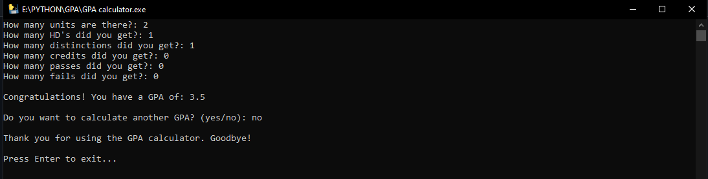

# GPA Calculator

This is a simple tool to calculate your GPA, valid for RMIT University. This tool assumes that every unit is worth `12 credit points` and will ask the user for the following inputs:

- total amount of units studied
- How many subjects they achieved HD marks in
- How many subjects they achieved Distinction marks in
- How many subjects they achieved Credit marks in
- How many subjects they achieved Pass marks in
- How many subjects they failed

Provided that they are all `Positive Integers` being inputted and the `Number of Units` entered by the user is the same as the `Initial Amount of Units` stated:

The program will then output the `Current Accumulative GPA` for the user

The program will then ask if the user wants to `Calculate Another GPA`, based on the answer the program will either `loop` or `prompt the user to exit` by pressing the `"ENTER"` Key.

 
